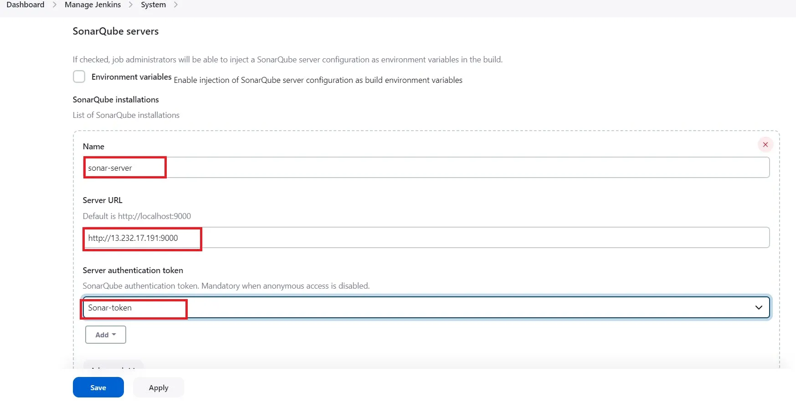
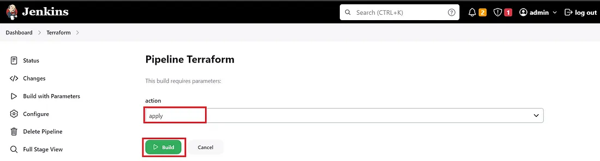

# STATIC WEBSITE USING S3 FROM TERRAFORM
In today’s fast-paced world of cloud computing, the ability to rapidly and efficiently provision infrastructure is a game-changer. This is where Infrastructure as Code (IaC) comes into play, allowing us to define and manage our infrastructure in a code-based manner. In this blog post, we will explore how to harness the power of IaC by using two essential tools: Terraform and Jenkins, in conjunction with Amazon Web Services (AWS).

Terraform is an open-source IaC tool that enables us to define, create, and manage our infrastructure using declarative configuration files. Jenkins, on the other hand, is a widely adopted automation server that helps streamline the software development and deployment process.

Our journey will encompass several key objectives:

Setting up Terraform and Jenkins: We’ll start by ensuring you have all the prerequisites in place, including an AWS account, Terraform, Jenkins, and Docker. We’ll walk you through the installation and configuration of these essential tools.
Creating the Terraform Scripts: We’ll delve into the heart of IaC by crafting Terraform scripts to provision AWS resources. Along the way, we’ll introduce the concept of user data, a powerful feature that allows us to automate tasks like launching containers within our instances.
Running Two Application Containers with User Data: To demonstrate the practical application of user data, we’ll guide you through launching not just one but two application containers within your AWS instances. This step showcases the versatility and automation capabilities of IaC.
DevOps project we will be using Terraform and AWS Cloud to set up static website hosting fully automated in seconds. This Terraform project will help beginners understand the concept and working of Terraform with AWS and how you can create a one-click automated solution using Terraform in DevOps
Setting up Infrastructure State Management:
## 1- S3 Bucket for Terraform State:
 We’ll create an AWS S3 bucket dedicated to securely storing your Terraform state files. This is essential for maintaining the state of your infrastructure in a central location.
## 2- DynamoDB Table for Locking: 
In addition to the S3 bucket, we’ll set up an AWS DynamoDB table to enable locking capabilities. This ensures that your infrastructure remains in a consistent state when multiple users are working concurrently.
## 3- Integrating Jenkins and Terraform: 
To tie it all together, we’ll demonstrate how to integrate Jenkins with Terraform. This integration will empower you to automate the provisioning process, enhance the efficiency of your infrastructure management, and ensure that your Terraform state is securely stored and locked when needed.
## Prerequisites:
Before you embark on the journey of provisioning AWS resources using Terraform and Jenkins, it’s crucial to ensure that you have all the necessary components and configurations in place. Here are the prerequisites you should have before starting this tutorial:

### AWS Account: 
You must have an active AWS account with administrative privileges or the necessary permissions to create and manage AWS resources.
### S3 Bucket for Terraform State:
Purpose: To securely store your Terraform state files remotely.
Steps:
Log in to your AWS Management Console.
Navigate to the S3 service.
Create an S3 bucket with a unique name in the desired AWS region.
Note down the bucket name as you’ll use it in your Terraform scripts.
### DynamoDB Table for Locking Capability:

Purpose: To enable locking for Terraform state management.
Steps:
Access the AWS Management Console.
Go to the DynamoDB service.
Create a DynamoDB table with a unique name and primary key.
Configure the table’s read and write capacity settings as needed.
Note down the table name for reference.
### 4.Jenkins setup:

Ensure that Jenkins is up and running in your environment.
Configure Jenkins with the necessary plugins for AWS and Terraform integration.
### 5.Terraform Installation in Jenkins:

Terraform should be installed on the Jenkins server to execute Terraform scripts as part of your CI/CD pipeline.
### 6.Terraform Files in Source Code Management (SCM):

Your Terraform configuration files should already be available in your Source Code Management system (e.g., Git). Make sure you have the necessary access rights to the repository.

### 7.IAM Role for Jenkins EC2 Instance:

Purpose: To grant the Jenkins EC2 instance the necessary permissions to interact with AWS resources.
Steps:
Create an IAM role in AWS.
Attach the appropriate policy that grants permissions for AWS resource provisioning, DynamoDB access, S3 bucket operations, and any other required permissions.
Associate the IAM role with the Jenkins EC2 instance.
### 8.GitHub Repository (Optional):

If you’re using a public repository as an example, you can fork the repository and start making changes in your own forked repository. Ensure that you have the necessary access to the repository.
With these prerequisites in place, you’ll be well-prepared to dive into the tutorial and learn how to leverage Terraform, Jenkins, AWS S3, and DynamoDB to automate the provisioning and state management of your AWS resources. These foundational components are key to a successful IaC implementation and CI/CD pipeline for infrastructure.
# TUTORIAL
* Launch an Ubuntu(22.04) T2 Large Instance
* Install Jenkins, Docker and Trivy
* After the docker installation, we create a sonarqube container (Remember to add 9000 ports in the security group).
```
docker run -d --name sonar -p 9000:9000 sonarqube:lts-community

```
* Install Plugins like JDK, Sonarqube Scanner, Terraform, Eclipse Temurin Installer, Docker, Docker Commons, Docker pipeline, Docker API, Docker build step
* Configure Java and Terraform, Docker in Global Tool Configuration


Add Docker Hub Username and Password under Global Credentials

* Configure Sonar Server in Manage Jenkins
Grab the Public IP Address of your EC2 Instance, Sonarqube works on Port 9000, so <Public IP>:9000. Goto your Sonarqube Server. Click on Administration → Security → Users → Click on Tokens and Update Token → Give it a name → and click on Generate Token

click on update Token

Create a token with a name and generate

copy Token

Goto Jenkins Dashboard → Manage Jenkins → Credentials → Add Secret Text. It should look like this

Now, go to Dashboard → Manage Jenkins → System and Add like the below image.


Click on Apply and Save

The Configure System option is used in Jenkins to configure different server

Global Tool Configuration is used to configure different tools that we install using Plugins

We will install a sonar scanner in the tools.


In the Sonarqube Dashboard add a quality gate also

Administration → Configuration →Webhooks


Click on Create


Add details

```
<http://jenkins-public-ip:8080>/sonarqube-webhook/

```


* create an IAM, S3 bucket and Dynamo DB table.
- Create IAM role for EC2 and add this permissions policies: AmazonEC2FullAccess, AmazonS3FullAccess, AmazonDynamoDBFullAccess
go to the Jenkins instance and add this role to the Ec2 instance.
- Click the “Table name” field. enter “dynamodb_table = “devsecops-west1-dynamo-db-table””

Click the “Enter the partition key name” field.

Type “LockID”


### jenkins pipeline 
Let’s create a Job now in Jenkins set a job name and add this pipeline
```
pipeline{
    agent any
    tools{
        jdk 'java17'
        terraform 'terraform'
    }
    environment {
        SCANNER_HOME=tool 'sonar-scanner'
    }
    stages {
        stage('clean workspace'){
            steps{
                cleanWs()
            }
        }
        stage('Checkout from Git'){
            steps{
                git branch: 'master', url: 'https://github.com/hugdora/Terraform-CICD-Jenkins.git'
            }
        }
        stage('Terraform version'){
             steps{
                 sh 'terraform --version'
                }
        }
        stage("Sonarqube Analysis "){
            steps{
                withSonarQubeEnv('sonar-server') {
                    sh ''' $SCANNER_HOME/bin/sonar-scanner -Dsonar.projectName=Terraform \
                    -Dsonar.projectKey=Terraform '''
                }
            }
        }
        stage("quality gate"){
           steps {
                script {
                    waitForQualityGate abortPipeline: false, credentialsId: 'sonar-tokens' 
                }
            } 
        }
        stage('TRIVY FS SCAN') {
            steps {
                sh "trivy fs . > trivyfs.txt"
            }
        }
         stage('Excutable permission to userdata'){
            steps{
                sh 'chmod 777 website.sh'
            }
        }
        stage('Terraform init'){
            steps{
                sh 'terraform init'
            }
        }
        stage('Terraform plan'){
            steps{
                sh 'terraform plan'
            }
        }
        stage('Terraform action'){
            steps{
                sh 'terraform ${action} --auto-approve'
            }
        }
    }
}

```
you will succeed but I want to do this with build parameters to apply and destroy while building only.

you have to add this inside job like below image


Now copy the newly created Instance Ip address
```
<instance-ip:3000> #zomato app container
<instance-ip:8081> #netflix app container

```


Then destroy everything